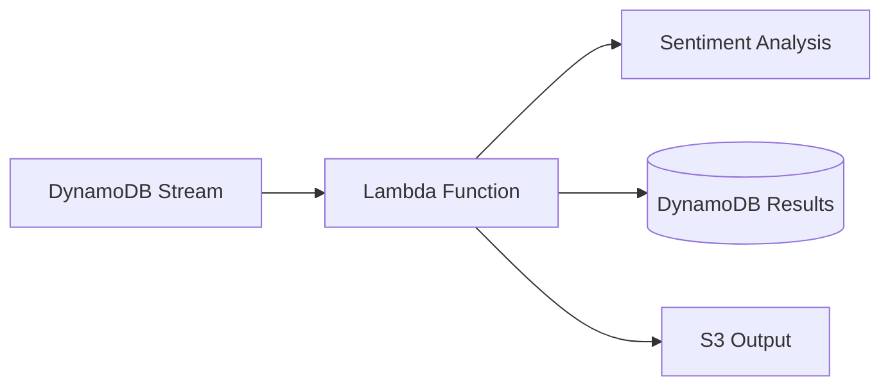

# LLM Analysis Pipeline

Serverless pipeline for sentiment analysis of text reviews using Large Language Models (LLM) via AWS services.

## Architecture


## Key Components
- **AWS Infrastructure** (Terraform managed):
  - Input/Output S3 Buckets
  - DynamoDB Table for results storage
  - Lambda Function with IAM execution role
  - Secrets Manager for API key storage
- **Sentiment Analyzer** (Python Lambda):
  - Processes DynamoDB stream events
  - Uses OpenRouter API (via Groq) for sentiment analysis
  - Stores results with confidence scores

## Prerequisites
- AWS account with CLI configured
- Terraform v1.5+
- Python 3.9+
- Groq API key

## Deployment
1. Clone repository:
   ```bash
   git clone https://github.com/seszele64/llm-analysis-pipeline.git
   cd llm-analysis-pipeline
   ```
2. Initialize Terraform:
   ```bash
   terraform init
   ```
3. Create `terraform.tfvars` with required variables:
   ```hcl
   groq_api_key = "your-api-key-here"
   ```
4. Apply configuration:
   ```bash
   terraform apply
   ```

## Lambda Configuration
The sentiment analyzer requires:
- IAM permissions for DynamoDB streams and Secrets Manager
- Python dependencies (see `requirements.txt`):
  ```bash
  cd lambda/sentiment_analyzer
  pip install -r requirements.txt -t .
  ```

## Workflow
1. New records in DynamoDB trigger Lambda invocation
2. Lambda handler:
   - Retrieves review text from stream events
   - Calls OpenRouter API for sentiment analysis
   - Stores results with confidence scores
   - Writes processed data to output DynamoDB table

## Testing
Run unit tests for Lambda handler:
```bash
cd lambda/sentiment_analyzer
python -m pytest test_handler.py
```

## Environment Variables
| Name          | Description                     |
|---------------|---------------------------------|
| SECRET_NAME   | Secrets Manager key name        |

## Troubleshooting
Check CloudWatch Logs for:
- `/aws/lambda/sentiment_analyzer`
- Secrets Manager access errors
- API connection timeouts

## Future Improvements
- Add batch processing
- Implement dead-letter queue
- Add monitoring dashboard
